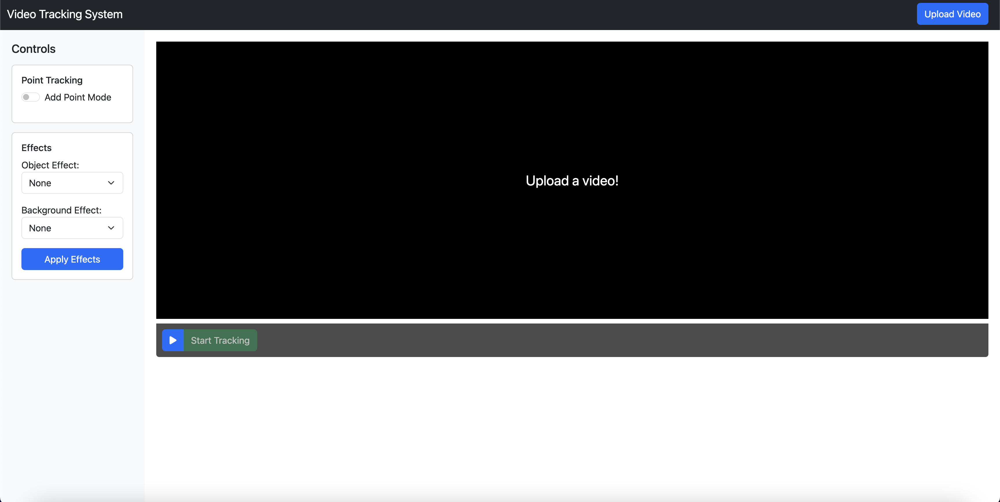
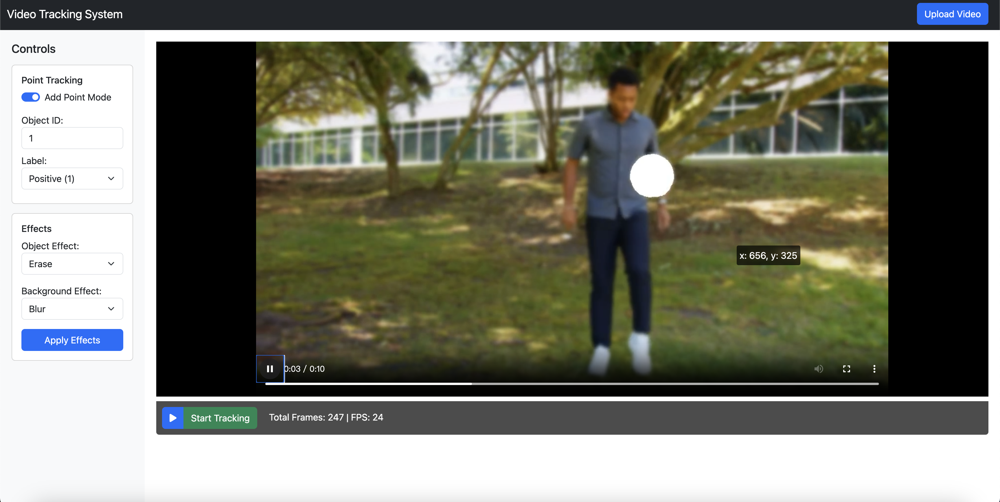

# Implementation and Testing

- [Task 3: Implement the System](#task-3-implement-the-system)

## Task 3: Implement the System

*Figure: The main interface of the system.*

*Figure: The interface after the user imports a video.*

*Figure: The effect after adding points and tracking.*

*Figure: The video after applying effects to the object.*