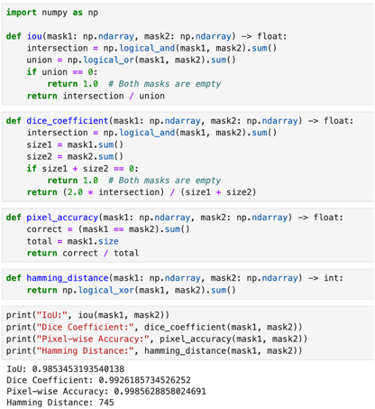

# Implementation and Testing

- [Task 3.1: Implement the System](#task-3-1-implement-the-system)

## Task 3.1: Implement the System

*Figure: The main interface of the system.*

*Figure: The interface after the user imports a video.*

*Figure: The effect after adding points and tracking.*

*Figure: The video after applying effects to the object.*

## Task 3.2: Test the System
To evaluate the model's performance, we chose IoU (Intersection over Union) and Dice Coefficient as evaluation metrics.

### IoU (Intersection over Union)
IoU is a core metric for evaluating the performance of segmentation models. It measures the overlap between the predicted region and the ground truth region, reflecting the model's accuracy. The higher the value, the more accurate the model is. Conversely, a lower value indicates less accurate predictions. Typically, the IoU value is compared to a preset threshold. If it exceeds this threshold, the model is considered accurate; otherwise, the model's prediction is deemed incorrect.

#### Calculation Method of IoU:
· IoU = |A ∩ B| / |A ∪ B| = |A ∩ B| / (|A| + |B| - |A ∩ B|)

- **A**: Predicted region.
- **B**: Ground truth region.
- |A ∩ B|: The intersection of the predicted and ground truth regions, i.e., the overlapping area.
- |A ∪ B|: The union of the predicted and ground truth regions, i.e., the total area of both regions.
- |A|: The area of the predicted region.
- |B|: The area of the ground truth region.
IoU provides an intuitive way to measure the relationship between model predictions and ground truth values and can be used for various tasks. However, it may not perform as expected when dealing with small objects or class imbalance.

### Dice Coefficient
The Dice coefficient is similar to IoU, emphasizing the size of the overlapping region and being more sensitive when dealing with imbalanced datasets. A higher value indicates that the model's predictions are close to the ground truth, while a lower value indicates less accurate predictions.

#### Calculation Method of Dice Coefficient:
· Dice = 2 * |A ∩ B| / (|A| + |B|)

- **A**: Predicted region.
- **B**: Ground truth region.
- |A ∩ B|: The intersection of the predicted and ground truth regions, i.e., the overlapping area.
- |A|: The area of the predicted region.
- |B|: The area of the ground truth region.

Compared to IoU, the Dice coefficient performs well when handling small objects and provides a more comprehensive evaluation in the case of class imbalance. However, it is less sensitive to large object predictions and more complex to compute.

Using both IoU and Dice as evaluation metrics allows for a more comprehensive and reliable assessment of the model's performance from different perspectives, making it suitable for various application scenarios.

*Figure: The system's performance evaluation using IoU and Dice Coefficient.*
- **IoU**: 0.985
- **Dice Coefficient**: 0.993
- **Pixel Accuracy**: 0.999
- **Results**: The IoU value is approximately 0.985, the Dice coefficient is approximately 0.993, and the pixel accuracy is approximately 0.999. This indicates a high overlap between the predicted region and the ground truth region, demonstrating excellent model accuracy. The model is able to correctly identify and classify targets in the vast majority of cases.